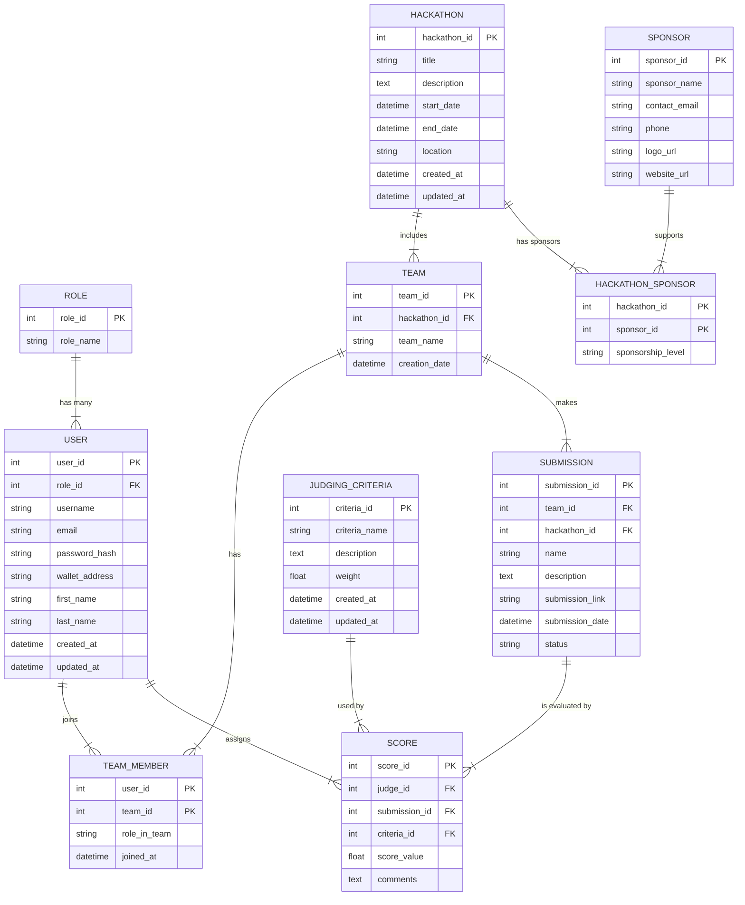

```mermaid 
erDiagram

    %% ------------------------------------------------------
    %% ROLE
    %% ------------------------------------------------------
    ROLE {
        int    role_id PK
        string role_name
    }

    %% ------------------------------------------------------
    %% USER
    %% ------------------------------------------------------
    USER {
        int    user_id PK
        int    role_id FK
        string username
        string email
        string password_hash
        string wallet_address
        string first_name
        string last_name
        datetime created_at
        datetime updated_at
    }

    %% ------------------------------------------------------
    %% HACKATHON
    %% ------------------------------------------------------
    HACKATHON {
        int    hackathon_id PK
        string title
        text   description
        datetime start_date
        datetime end_date
        string location
        datetime created_at
        datetime updated_at
    }

    %% ------------------------------------------------------
    %% TEAM
    %% ------------------------------------------------------
    TEAM {
        int    team_id PK
        int    hackathon_id FK
        string team_name
        datetime creation_date
    }

    %% ------------------------------------------------------
    %% TEAM_MEMBER
    %% ------------------------------------------------------
    TEAM_MEMBER {
        int    user_id PK 
        int    team_id PK  
        string role_in_team
        datetime joined_at
    }

    %% ------------------------------------------------------
    %% SUBMISSION
    %% ------------------------------------------------------
    SUBMISSION {
        int    submission_id PK
        int    team_id FK
        int    hackathon_id FK
        string name
        text   description
        string submission_link
        datetime submission_date
        string status
    }

    %% ------------------------------------------------------
    %% JUDGING_CRITERIA
    %% ------------------------------------------------------
    JUDGING_CRITERIA {
        int    criteria_id PK
        string criteria_name
        text   description
        float  weight  
        datetime created_at
        datetime updated_at
    }

    %% ------------------------------------------------------
    %% SCORE
    %% ------------------------------------------------------
    SCORE {
        int    score_id PK
        int    judge_id FK      
        int    submission_id FK
        int    criteria_id FK
        float  score_value        
        text   comments
    }

    %% ------------------------------------------------------
    %% SPONSOR
    %% ------------------------------------------------------
    SPONSOR {
        int    sponsor_id PK
        string sponsor_name
        string contact_email
        string phone
        string logo_url
        string website_url
    }

    %% ------------------------------------------------------
    %% HACKATHON_SPONSOR
    %% ------------------------------------------------------
    HACKATHON_SPONSOR {
        int    hackathon_id PK  
        int    sponsor_id PK   
        string sponsorship_level
    }


    %% ------------------------------------------------------
    %% (Optional) RELATIONSHIPS
    %% ------------------------------------------------------
    %% You can uncomment or adjust these to visualize connections.
    %% For clarity, they are commented out here. If you wish to see
    %% relationships in the diagram, remove the "%%" at line beginnings.

     ROLE ||--|{ USER : "has many"
     USER ||--|{ TEAM_MEMBER : "joins"
     TEAM ||--|{ TEAM_MEMBER : "has"
     HACKATHON ||--|{ TEAM : "includes"
     TEAM ||--|{ SUBMISSION : "makes"
     SUBMISSION ||--|{ SCORE : "is evaluated by"
     JUDGING_CRITERIA ||--|{ SCORE : "used by"
     USER ||--|{ SCORE : "assigns"
     SPONSOR ||--|{ HACKATHON_SPONSOR : "supports"
     HACKATHON ||--|{ HACKATHON_SPONSOR : "has sponsors"

```
